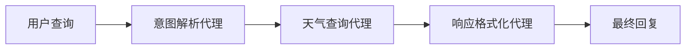

# AutoGen 多代理协作天气查询系统

基于 Microsoft AutoGen 框架的多代理协作天气查询系统。

## 🌟 项目特色

- 🧠 **意图解析代理** - 分析用户查询意图，提取城市和时间信息
- 🌤️ **天气查询代理** - 调用天气 API 获取数据
- ✨ **响应格式化代理** - 格式化输出并提供生活建议
- 🎯 **多代理协作** - 三个代理协作完成查询任务

## 📁 项目结构

```plain
weather_autogen/
├── weather_team.py      # 多代理协作管理器
├── weather_agents.py    # 代理定义和 MCP 工具集成
├── weather_cli.py       # 命令行界面
├── mcp_server/          # MCP 服务器
├── requirements.txt     # 依赖包
└── README.md           # 项目文档
```

## 🚀 快速开始

### 1. 进入项目目录

```bash
cd mcp/weather_autogen
```

### 2. 激活虚拟环境（如果还没有）

```bash
# 创建虚拟环境
python -m venv .venv

# 激活虚拟环境
source .venv/bin/activate  # macOS/Linux
# 或 .venv\Scripts\activate  # Windows
```

### 3. 安装依赖

```bash
pip install -r requirements.txt
```

### 4. 设置 API 密钥

```bash
export OPENAI_API_KEY='your-openai-api-key'
```

### 5. 运行天气查询系统

```bash
# 推荐：简洁的命令行界面
python weather_cli.py

# 或者：原始的多代理协作演示
python weather_team.py
```

## 🎭 多代理协作流程



### 协作示例

**用户输入**：`"上海明天天气"`

1. 🧠 **意图解析代理**：

   ```plain
   城市：上海
   时间：tomorrow
   查询：查询上海明天的天气
   ```

2. 🌤️ **天气查询代理**：

   ```plain
   调用 query_weather_tomorrow("上海")
   获取天气数据
   ```

3. ✨ **响应格式化代理**：

   ```plain
   美化输出 + 添加生活建议
   ```

## 🎯 支持的查询类型

| 查询类型 | 示例           | 代理协作流程     |
| -------- | -------------- | ---------------- |
| 今日天气 | "今天天气"     | 解析→查询→格式化 |
| 明日天气 | "北京明天天气" | 解析→查询→格式化 |
| 未来天气 | "未来三天天气" | 解析→查询→格式化 |
| 城市指定 | "上海今天天气" | 解析→查询→格式化 |

## 🛠️ 技术架构

### 核心组件

- **WeatherAgentTeam**: 多代理协作管理器
- **意图解析代理**: 分析用户查询意图
- **天气查询代理**: 通过 MCP 协议调用天气工具
- **响应格式化代理**: 格式化输出结果

### 工具函数

- `query_weather_today(city)` - 查询今天天气
- `query_weather_tomorrow(city)` - 查询明天天气
- `query_weather_future_days(city, days)` - 查询未来几天天气

## 🔧 自定义扩展

### 添加新的 agent

```python
def create_new_agent(model_client):
    return AssistantAgent(
        name="new_agent",
        model_client=model_client,
        description="新代理的描述",
        system_message="代理的系统消息..."
    )
```

### 添加新的工具

在 MCP 服务器中添加新的工具，然后 AutoGen 会自动发现并使用。

## 🌈 运行示例

```plain
🤖 初始化天气查询系统...
✅ 系统准备就绪！

🗣️  用户查询: 今天北京天气怎么样
──────────────────────────────────────────────────
🔄 启动多代理协作...
   📋 意图解析代理 → 解析查询意图
   🌤️  天气查询代理 → 获取天气数据
   ✨ 响应格式化代理 → 美化输出结果

📋 查询结果:
根据最新天气预报，北京今天的天气是阴天，气温在27°C到35°C之间...
```

## 🔍 故障排除

### 常见问题

1. **API 密钥未设置**

   ```bash
   export OPENAI_API_KEY='your-api-key-here'
   ```

2. **依赖包问题**

   ```bash
   pip install -r requirements.txt --force-reinstall
   ```

3. **Python 环境问题**

   ```bash
   python --version  # 确保 Python 3.8+
   ```

## 📊 项目信息

- **代理数量**: 3 个（意图解析、天气查询、响应格式化）
- **MCP 工具**: 4 个（通过 MCP 协议集成）
- **支持城市**: 37 个中国主要城市
- **技术栈**: AutoGen + MCP + 彩云天气 API

---
